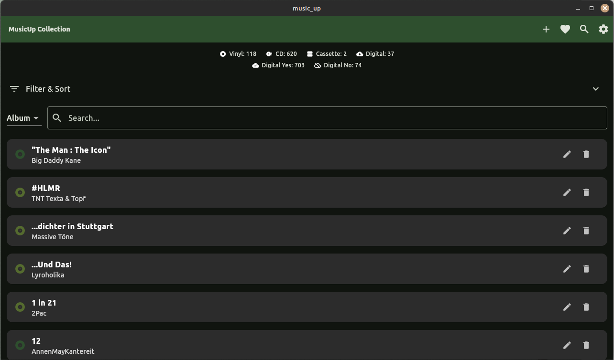

# MusicUp


**MusicUp** is a Flutter-based application designed to help users manage their extensive music collections efficiently.
Whether you're a music enthusiast organizing your CDs and vinyls or an artist managing your discography, MusicUp offers
a seamless experience for importing, exporting, and maintaining your album data.

## Table of Contents

- [Features](#features)
- [Screenshots](#screenshots)
- [Installation](#installation)
- [Packaging for Debian](#packaging-for-debian)
- [Usage](#usage)
- [Testing](#testing)
- [Motivation](#motivation)
- [Contributing](#contributing)
- [License](#license)
- [Contact](#contact)

## Features

- **Add Albums:** Easily add new albums with details such as name, artist, genre, year, medium, and digital
  availability.
- **Edit Albums:** Modify existing album information to keep your collection up-to-date.
- **Import/Export:** Support for importing and exporting album data in JSON, CSV, and XML formats.
- **Duplicate Prevention:** Automatically avoids adding duplicate albums during import.
- **Search & Filter:** Quickly find albums using search and filter functionalities.
- **User-Friendly Interface:** Intuitive design for effortless navigation and management.

## Screenshots


*Main Screen displaying a list of albums.*


*Add Album screen with form fields.*


*Exporting albums in different formats.*

## Installation

### Prerequisites

- **Flutter SDK:** Ensure you have Flutter installed. Follow
  the [official installation guide](https://flutter.dev/docs/get-started/install) if you haven't set it up yet.
- **Dart SDK:** Comes bundled with Flutter.
- **Git:** To clone the repository.

### Steps

1. **Clone the Repository:**

   ```bash
   git clone https://github.com/hiphopconnect/music_up.git
   cd music_up
   ```

2. **Install Dependencies:**

   ```bash
   flutter pub get
   ```

3. **Run the App:**

   ```bash
   flutter run
   ```

## Packaging for Debian

To create a `.deb` package for **MusicUp**, ensure you have all dependencies installed, then follow these steps:

1. Make the script executable:

   ```bash
   chmod +x create_deb.sh
   ```

2. Run the script to build the Debian package:

   ```bash
   ./create_deb.sh
   ```

This will generate a `.deb` package, which you can install on any Debian-based system.

## Usage

Once installed, **MusicUp** can be launched from your system's application menu. You can add, edit, and manage your
music collection easily from the user interface. Import or export your collection to/from JSON, CSV, or XML formats as
needed.

## Testing

You can run the tests for **MusicUp** using Flutter's built-in testing framework. To run all tests, use:

```bash
flutter test
```

This will execute all unit and widget tests available in the repository.

## Motivation

The idea for **MusicUp** came from my personal need to organize a large collection of CDs and vinyl records. Initially,
I used a paid app that allowed scanning albums, but it often failed to find certain CDs, requiring manual entries. As a
result, I decided to build **MusicUp**, focusing on ease of use and customization. Scanning is a feature I may consider
adding in the future, but for now, manual input is still a reliable option.

Currently, I have only tested the Linux desktop version, specifically on Linux Mint.

## Contributing

Contributions are welcome! If you have ideas or improvements, feel free to fork the repository and submit a pull
request. Make sure to follow best practices when contributing.

## License

**MusicUp** is licensed under the **GNU General Public License v3.0** - see
the [LICENSE](https://www.gnu.org/licenses/gpl-3.0.html) file for details.

### Key points of the GNU GPLv3:

- **Freedom to use, modify, and distribute**: You are free to use, modify, and distribute this software, as long as you
  adhere to the GPLv3 conditions.
- **Copyleft**: Any modifications or derived works must also be distributed under the GPLv3 license.
- **Source code availability**: If you distribute the software, you must make the full source code available, including
  any modifications.
- **Patent protection**: The license prevents any patent claims against users of the software.
- **No "Tivoization"**: Hardware that uses GPLv3 software must allow installation of modified software by users.

For more information, please refer to the [official GPLv3 license](https://www.gnu.org/licenses/gpl-3.0.html).

## Contact

For any inquiries or feedback, feel free to contact me
at [Nobo](mailto:nobo_code@posteo.de?subject=[GitHub]%Source%20MusicUP).